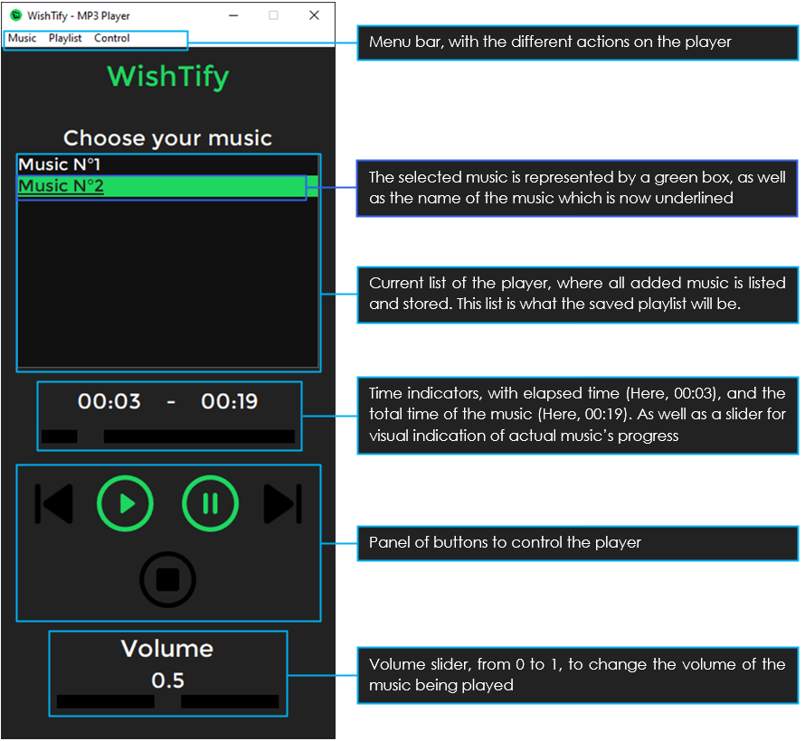

# WishTify
### What is it ?

`WishTify` is a MP3 Player built using Python, with the aim of having an intuitive interface, which looks like a MP3 Walkman.  
Using `WishTify`, you'll be able to import your musics, and also create several playlists that you can save on your computer.

# Table of Contents
- [Installation](#Installation)
- [How to use WishTify](#How-to-use)
- [Additionnal Informations](#Additionnal-Informations)
- [Credits](#Credits)

# Installation
- Clone this git or download it
- Install [PyGame](https://www.pygame.org/) : `pip install pygame`
- Install [Mutagen](https://mutagen.readthedocs.io/en/latest/) : `pip install mutagen`

# How to use

### Basics

`WishTify`'s code is fully commented in english, for ease and convenience.  
In `WishTify`'s folder, you can find a `song` folder and a `playlist` folder. Both of them are only present for ease of use and convenience, they aren't actually used by `WishTify`, and you can play music and store playlists everywhere on your computer.

Here is an image with basics explanations on it :

# Additionnal Informations
### About songs
You can read [this document](song/Song.md) for more informations about songs.
### About playlists
You can read [this document](playlist/Playlist.md) for more informations about playlists.

# Credits
This MP3 Player is provided to you by :  
-  [@OniXGaming](https://github.com/OniXGaming)
-  [@AssADev](https://github.com/AssADev)
